  

  <h3 style="font-family: 'Brush Script MT', cursive; color: #8A2BE2;">
    𝐻𝒾 𝓉𝒽𝑒𝓇𝑒, 𝐼'𝓂 <a href="https://t.me/debugGod" target="_blank" style="color: #9370DB;">𝒜𝓁𝒾𝓃𝒶</a> 
    
  </h3>
  <h3>
    
  </h3>  

&nbsp;***Leetcode Stats***

&nbsp; &nbsp; &nbsp; &nbsp; &nbsp; &nbsp;

✨ <b>Click for motivational quote</b>

 

&nbsp; ***Skills***

  <h3 style="color: #8A2BE2; font-family: 'Brush Script MT', cursive;">

```mermaid
%%{init: {'theme': 'dark', 'themeVariables': {'primaryColor': '#1a0633'}}}%%
flowchart TD
    %% Стили компонентов
    classDef core fill:#8A2BE2,stroke:#00f7ff,stroke-width:3px,stroke-dasharray:5
    classDef backend fill:#1a0633,stroke:#00f7ff,stroke-width:2px
    classDef frontend fill:#1a0633,stroke:#ff00aa,stroke-width:2px
    classDef devops fill:#1a0633,stroke:#00ffaa,stroke-width:2px
    classDef database fill:#1a0633,stroke:#ff5500,stroke-width:2px,stroke-dasharray:3 3
    classDef tools fill:#1a0633,stroke:#ffcc00,stroke-width:2px

    %% Центральное ядро
    C(("🌌 Core<br>Skills")):::core

    %% Backend Galaxy
    subgraph "Backend Galaxy"
        B1["Java"]:::backend
        B2["Spring"]:::backend
        B3["Hibernate"]:::backend
    end

    %% Frontend Nebula
    subgraph "Frontend Nebula"
        F1["HTML5"]:::frontend
        F2["CSS3"]:::frontend
        F3["JavaScript"]:::frontend
    end

    %% DevOps Wormhole
    subgraph "DevOps Wormhole"
        D1["Docker"]:::devops
        D2["Kubernetes"]:::devops
        D3["AWS"]:::devops
    end

    %% Database Cluster
    DB1["PostgreSQL"]:::database
    DB2["MongoDB"]:::database
    DB3["Redis"]:::database

    %% Tools Comet Tail
    T1["IntelliJ"]:::tools
    T2["Git"]:::tools
    T3["Maven"]:::tools

    %% Двунаправленные связи
    C <--> B1 & B2 & B3
    C <-.-> F1 & F2 & F3
    C <==> D1 & D2 & D3
    C o--o DB1 & DB2 & DB3
    C -.- T1 & T2 & T3

    %% Связи между компонентами
    B1 <-.-> DB1
    B2 <--> D1
    F3 -.- DB2
    D3 <==> T3
```

   (っ◔◡◔)っ 𝒯𝒽𝒶𝓉'𝓈 𝒶𝓁𝓁, 𝓈𝑒𝑒 𝓎𝑜𝓊 𝓁𝒶𝓉𝑒𝓇! 
 
  </h3>
  <h3>
    
  </h3>

&nbsp;***Communication Channels***

